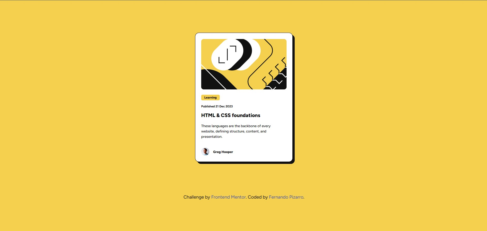

# Blog preview card

This is a solution to the [Blog preview card challenge on Frontend Mentor](https://www.frontendmentor.io/challenges/blog-preview-card-ckPaj01IcS).

## 🔗 Links

- Live Site: [https://tuusuario.github.io/blog-preview-card](https://tuusuario.github.io/blog-preview-card)
- Solution: [Frontend Mentor Solution Page](https://www.frontendmentor.io/solutions/...)

## 💡 Overview

### The challenge

Users should be able to:

- View the optimal layout depending on their device's screen size
- See hover states for interactive elements

### Screenshot

### What I learned

This challenge helped me improve my CSS skills, especially:

- Using variables for colors
- Writing mobile-first responsive layouts
- Applying Flexbox for alignment
- Adjusting spacing and layout with padding and margin instead of fixed width/height

### Built with

- Semantic HTML5 markup
- CSS custom properties
- Flexbox
- Mobile-first workflow

## 🧠 Author

- GitHub - [@fernandopizarrodw](https://github.com/fernandopizarrodw)
- Frontend Mentor - [@fernandopizarrodw](https://www.frontendmentor.io/profile/fernandopizarrodw)
- LinkedIn - [fernandopizarro-dev](https://www.linkedin.com/in/fernandopizarro-dev)
